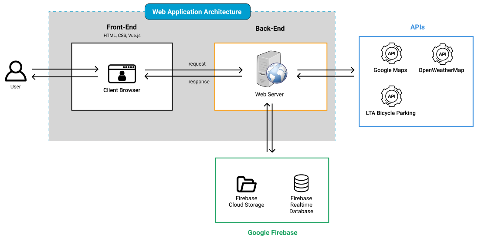
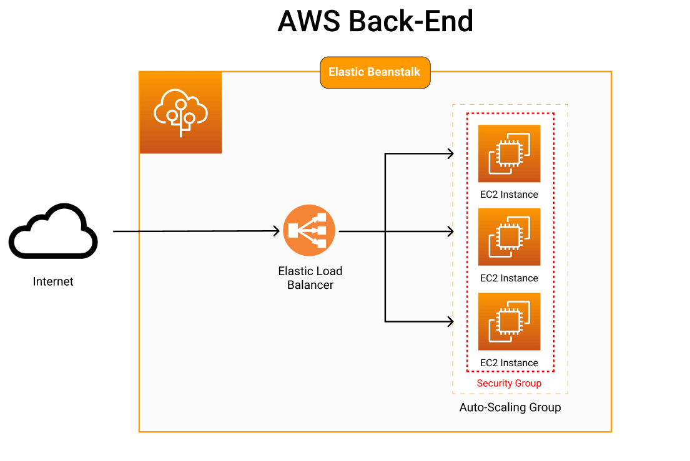
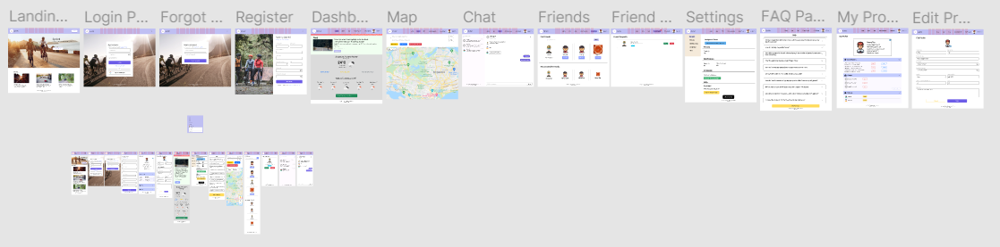
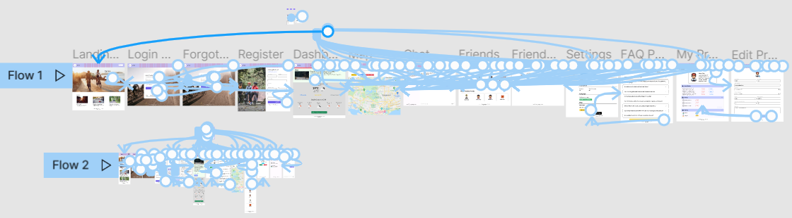
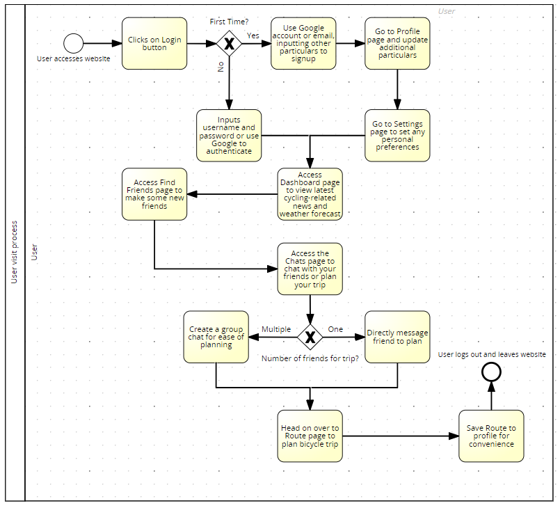

# :wave: is216-project

**API Keys:**
* Google Maps API - Maps feature
* LTA Datamall API - Bicycle Parking Spots
* OAuth 2.0 credentials from Google API Console - Google Login

# IS216 - Group 6 - HardToFindIdeas :thinking:

## Table of Contents
* [Group Members](#family-group-members)
* [Project Overview](#bicyclist-project-overview-bicyclist)
    * [Features](#star-features)
    * [Target Audience](#dart-target-audience)
    * [System Architecture](#globe_with_meridians-system-architecture)
    * [Solution Design](#solution-design-figma)
    * [AWS Cloud Deployment](#cloud-aws-cloud-deployment)
* [Installation Guide (for Developers)](#computer-installation-guide-for-developers)
* [AWS Deployment Guide (for Developers)](#cloud-aws-deployment-guide-for-developers)
* [How to Use (for Visitors)](#question-how-to-use-our-web-application-for-visitors-to-our-website)
    * [Point to Note](#warning-point-to-note)
* [Others](#notebook_with_decorative_cover-others)

## :family: Group Members

| # | Name | SMU Email Address | Roles and Responsibilities |
| ----------- | ----------- | ----------- | ----------- |
| 1 | Yong Woon Hao | whyong.2020@smu.edu.sg | <ul><li>Business requirements</li><li>Profile page</li><li>Edit Profile page</li><li>GitHub</li><li>Solution architecture diagram</li><li>Google Firebase</li><li>AWS cloud deployment</li><li>Business process diagram</li><li>Readme</li><li>Presentation slides and content</li></ul>|
| 2 | Jordan | | <ul><li>Settings Page</li><li>FAQ Page</li><li>Find Friends Page</li><li>Dark Mode Implementation</li><li>Application Logo</li><li>Figma</li></ul>
| 3 | Andrea | | <ul><li>Google Maps + functions</li><li>Friends recommender system</li><li>Show recommended friends on find-friends.html</li><li>Bootstrap grid for cards</li><li>Show routes on profile page</li><li>Redirect to map, with auto filled in address</li><li>Website screenshots on README</li></ul>
| 4 | Rui Xin | | <ul><li>Login Page</li><li>Google Login</li><li>Forgot Password Page</li><li>Register Page</li><li>Dashboard Page</li><li>Responsive Design of website</li><li>Worked on Aesthetics/Design for different pages</li><li>Figma</li><li>Presentation content</li><li>Edit Video for Presentation and upload to YouTube</li></ul>|
| 5 | Genevieve | | <ul><li>Index page</li><li>Groups and Friends on Profile page</li><li>Edit profile validations</li><li>Chat page</li><li>Friend Requests page</li><li>Add friends on Find Friends page</li><li>Preloading screen on Dashboard page</li><li>Figma</li><li>Presentation content</li></ul>

## :bicyclist: Project Overview :bicyclist:
### Background
As COVID-19 became more widespread around the world, social restriction measures were introduced, bringing people physically away from each other. In Singapore, Singaporeans took to cycling to cope with this new norm, purchasing more personal bicycles and participating in more bike-sharing activities, as seen from [this article](https://www.channelnewsasia.com/singapore/covid-19-cycling-popularity-bicycle-sales-shared-bikes-631621).

Additionally, according to [this article from CNA](https://cnalifestyle.channelnewsasia.com/living/singapore-google-maps-cycling-navigation-feature-287201), Cordula Oertel, Google's Head of Geo Partnerships in South East Asia, said there was a sharp increase in searches for cycling routes in Google, up 75% from 2020 and up 400% from 2019. It was because of this increase that Google decided to implement cycling navigation, a new feature in Google Maps for Singapore which is also the first of its kind in South East Asia.

However, cycling as a sport or activity in itself has always been [very exclusive](https://observer.case.edu/while-other-professional-sports-become-more-inclusive-cycling-remains-racially-exclusive/). Therefore, as cycling is becoming more popular in Singapore, we sought to make cycling more inclusive and more social than it was before, by creating a platform where like-minded people can discover and meet each other. This is how our application **Cyclink** was born. According to an [article by The Harvard Gazette](https://news.harvard.edu/gazette/story/2021/02/young-adults-teens-loneliness-mental-health-coronavirus-covid-pandemic/), social isolation and loneliness has also seen a rise due to COVID-19 especially in older teens and young adults. Through this application, we hope to do our part in reducing these negative feelings.

    <h1 style="color: #6C5CE7">Cyclink</h1>
    

### :star: Features
* User sign up, sign in, sign out with session management
  * [Google Login](https://developers.google.com/identity/gsi/web) for easier authentication
* GPS functionality to find current location
* Keep up with the latest cycling-related news in the dashboard
* Friend system with direct and group chat messaging for users to keep in touch with each other
* Give users suggestions for friends which are other users of Cyclink of similar age and years of experience
* Integration with [Google Maps](https://www.google.com/maps) to plan out routes with directions and save them for future use
* Integration with [OpenWeatherMap](https://openweathermap.org/) to view current location weather for ease of route planning
* Added locations of Singapore's bicycle parking spots for user convenience
* Deployed in AWS cloud for better availability and scalability
* Database and storage system hosted by Google Firebase in the cloud

### :dart: Target Audience
We are targeting those who **own a bicycle and cycle frequently** or even those who are just **starting out their journey into cycling**. We have no specific demography in mind with regards to age, gender or location as almost anyone is able to pick up cycling.

### :globe_with_meridians: System Architecture

**Front-End:** Majority of the code is written using **HTML, CSS and Vue.js** which will be rendered for the user to see in their client browser. This client browser is where users will send requests towards the web server and receive responses from the web server to render content.

**Back-End:** Main coding language used for all functionality is **JavaScript** with some **jQuery** involved. The web server for our web application is hosted on the cloud by [Amazon Web Services (AWS)](https://aws.amazon.com/). This is where requests made by the user are received and data is prepared to be sent back to the client's browser.

**External:** Some external resources are used in our application such as [Google Firebase](https://firebase.google.com/) and a few APIs. **Google Firebase Cloud Storage** is used for our application's storage system while **Google Firebase Realtime Database** is our choice of database to save data about our users and relevant details. We use 3 APIs in our application to draw data from: [Google Maps](https://developers.google.com/maps/documentation), [OpenWeatherMap](https://openweathermap.org/api), [LTA Bicycle Parking](https://datamall.lta.gov.sg/content/datamall/en/dynamic-data.html).

**AWS:** As we used [AWS Elastic Beanstalk](https://aws.amazon.com/elasticbeanstalk/) to deploy our web server and application, AWS resources were automatically provisioned in the cloud.
* **EC2 Instance**
    * Represents a web server in the cloud
* **Elastic Load Balancer**
    * Any traffic from the internet will be sent to the Elastic Load Balancer, which acts as a sort of traffic router to ensure no single EC2 instance is overloaded with traffic.
* **Auto Scaling Group**
    * EC2 instances are in an auto-scaling group which basically means that as internet traffic increases past a certain point, additional instances will be provisioned to meet the demand and vice-versa.
* **Security Group**
    * Controls what traffic can be accepted into the EC2 instance and what cannot

All these resources work together to ensure high scalability, availability and security while still maintaining good performance for our application.

### [Solution Design (FIGMA)](https://www.figma.com/file/zCo8D4sdEE44OBkKfTQ2na/WAD2-Group-6-Solution-Design?node-id=0%3A1)
We used FIGMA to design our solution before actually coding it out so that we will have a point of reference to start from. The link to our designs is in the header.

---

### :cloud: [AWS Cloud Deployment](http://cyclink.ap-southeast-1.elasticbeanstalk.com/)
We decided to go with an AWS cloud deployment to leverage the services that it can provide such as better availability and scalibility. We used Elastic Beanstalk to deploy our application as it adds a layer of abstraction, automatically provisioning required resources for us. The link to the deployed web application is in the header.

---

## :computer: Installation Guide (for Developers)
For our application, most of the setup can be done locally with the exception of the setup of Google Firebase.

### Google Firebase setup
1. Login to [Google Firebase Console](https://console.firebase.google.com/) with your Google account
2. Add a new project with a name of your choice
3. Enable **Google Analytics** for your project for advanced metric collection
4. Add a new web application and register it
5. Choose the **Use a script tag option** and save the **firebaseConfig** details
6. Select **Realtime Database** from the left-side bar, then **Create Database**
7. Select the location of your choice and the security rules according to your security needs (this can be modified later) and click **Enable**
8. Select **Storage** from the left-side bar and **Get started**, then **Next** and choose the location as well (preferably same location as Realtime Database)
9. After it has been created, create a folder in **Storage** called **profile_photos**

:thumbsup: That's it for the Google Firebase setup!

### Local setup
1. Replicate the web application source files locally by cloning the Github repository
2. Edit the source JavaScript files **firebaseConfig** variable to the config details of your Firebase project environment that you saved earlier
3. Ensure that [WAMP](https://www.wampserver.com/en/) or [MAMP](https://www.mamp.info/en/windows/) is installed and run it

**(Windows)** You can now access the web application on your local server with the url **"localhost/[directory]"** with [directory] representing the directory which you cloned the Github repository to. 

**(Mac)** You can now access the web application on your local server with the url **"localhost/htdocs/[directory]"** with [directory] representing the directory which you cloned the Github repository to.

:thumbsup: Congratulations! You have replicated the development environment in your local laptop computer!

## :cloud: AWS Deployment Guide (for Developers)
As mentioned earlier, we deployed our web application on [AWS](https://aws.amazon.com/) using [AWS Elastic Beanstalk](https://aws.amazon.com/elasticbeanstalk/). It is a relatively easier way to deploy web applications without worrying too much about the resources required and how to provision them, which is automatically done for you.

1. Login to the [AWS Console](https://console.aws.amazon.com/console/home) using your AWS account
2. Navigate to the **Elastic Beanstalk** service
3. Go to **Environments** on the left-side bar and select **Create a new environment**
4. Choose the **Web server environment** option and click **Select**
5. Input your choice of **Application name**, **Environment name** and **Domain**
6. Choose the **Managed Platform** option and select **Tomcat** as the platform from the dropdown list
7. In the **Application code** section select **Upload your code**
8. Zip up all the source files of the web application into a folder and upload it into Elastic Beanstalk with **Choose file**
9. Select **Configure more options** and edit **Capacity**
10. **(Optional)** Change **Environment type** to **Load balanced** and set up minimum and maximum instances accordingly, also changing any additional options as you see fit
11. Remove **t2.small** under **Instance types** to stay in the free tier
12. Finish by selecting **Create environment**

After giving AWS a few minutes to set up the environment for you, you can now access the web application with the given URL for each environment.

:thumbsup: Congratulations, you are finished with deployment in the cloud using Elastic Beanstalk!

---

### :briefcase: Business Process Diagram

## :question: How to Use Our Web Application (for Visitors to our Website)
*Scenario modelled after the **Business Process Diagram** above*

### :warning: Point to note

There are additional features that only works on a secure website eg. https which we are unable to achieve due to limitations with AWS Elastic Beanstalk which only allows for http addresses unless we register a custom domain with Singapore which would incur additional costs. For testing purposes, you can access the website on localhost and follow the instructions below.

* Go to this [link](https://cors-anywhere.herokuapp.com/corsdemo) and click on the button to **request for temporary access**
* Ensure that you have enabled location services on your browser 

The **Where Am I** and **Parking Spots Near Me** button in the Map page will now be fully functional for use.
Similarly, the **Sign in with Google** in the Login page only works with a secure domain or localhost.

1. Access our website through this [link](http://cyclink.ap-southeast-1.elasticbeanstalk.com/) and you'll be greeted with this page 
2. **Login** or **Register** if it is your first time on the website:  
3. You will be directed to the **Dashboard** page where you can see the latest cycling-related news and weather forecast for the next few days:  
4. Update your particulars and details in the **Profile** page for a more enhanced experience, you can access your saved routes, groups and added friends here! 👍     
5. Want to change your profile details? Just click the edit button at the top right of your profile which will bring you to the **Edit Profile** page! 
6. You can go to the **Settings** page to set any personal preferences that you might have 
7. Head on over to the **Find Friends** page to meet some like-minded people who are similar to you. You can send them friend requests if you are keen to contact them! Don't know who to add? Fret not! Just look at the recommended section to view users whom you share similarities with! 
8. As you are waiting for them to accept your friend request, you can go to the **Map** page to start planning your next bicycle trip! Save your routes, get your exact current location and view nearby parking spaces by clicking on the respective buttons! 😃  
9. Once your friend request is accepted, you can head to the **Chats** page to chat with them, groups can also be created so that you can chat and plan your bicycle trips together in a group setting 
10. As our website is designed for mobile phone usage as well, you can visit our website to continue using its functions while on the go!

## :notebook_with_decorative_cover: Others
* We used [js-cookie](https://github.com/js-cookie/js-cookie), a JavaScript library, to manage our cookies and session management to preserve user login data across the website

Register Page / Login Page / Edit Profile Page
* Used an eye-toggler to enable users to view their password
* Added regex validations to check that only expected characters are present in the fields

Login Page / Forgot Password Page
* Used [SmtpJS](https://smtpjs.com/) create a SMTP connection to send a reset password email to users if they have selected the "Forgot Password" on the login page. The email sent reflects a reset password link, directing users to the forgot password page and allow users to change their password. 

Login Page
* Employed [Google Login](https://developers.google.com/identity/gsi/web) to allow users to have an easier point of entry to our website. If it is the first time user logs in using Google Login, they would be redirected to the register page with certain details, e.g., first name, last name, and their email address, that will be prepopulated. 
  * Should the same user log in again using their Google Login, they will be directed to the dashboard page (successful entry).
* Utilised local storage to store/save the username of the user when they click on the "Remember Me" checkbox and login

Between Login Page and Dashboard Page
* Added CSS animation to create a loading page when users login and used cookies to prevent animation from reloading when users go back and forth from page to page

Settings Page / FAQs Page

* Utilised local storage to store/save the user's preferences of dark/light mode to apply it to other pages and for subsequent visits as well
* FAQs utilises accordion to store each FAQ with the explanation within each accordion

Find Friends Page

* Links and retrieves data from the database to match the user's input and matches to the system.
* Inputs entered can either match the first name of the database, or is part of the first name (For example, the first 3 letters)
* Inputs are also checked against the database to ensure that friends searched by the user does not include the user himself if he happens to have the same first name
* Friends searched by user are also checked to ensure that friends with similar first name in his friend list are not shown again during the search (For example, if Henry Tan is already in his friend list, when he searches Henry, Henry Tan will not appear in his search)

Profile Page
* Retrieves user data from database and displays it
* Accordion from Bootstrap is used with 3 items: Saved Routes, Groups and Friends
* Under Saved Routes, this is where routes that are saved from the map will be displayed, with the option of **Delete** or **Open Map**. Delete will remove it from the database and from display and Open Map will redirect you to the map page with the route pre-populated in the inputs
* Under Groups, it will display all user groups with the option of leaving the group or creating a new group which will open a modal that allows you to pick a group name and members to add to the group from your friends list
* Under Friends, it will display all user friends and have the option of unfriending, which will remove the user as a friend from the database

Edit Profile Page
* Retrieves user data from database and displays it
* Changing any field and clicking **Save** will result in the database being updated to reflect this new change
* Editing the profile picture and clicking **Save** will result in the user-selected picture being uploaded to Google Firebase Cloud Storage and updating the photo in the database to point to the url of this new picture in the cloud storage

**News sources**
* https://www.channelnewsasia.com/singapore/covid-19-cycling-popularity-bicycle-sales-shared-bikes-631621
* https://cnalifestyle.channelnewsasia.com/living/singapore-google-maps-cycling-navigation-feature-287201
* https://observer.case.edu/while-other-professional-sports-become-more-inclusive-cycling-remains-racially-exclusive/
* https://news.harvard.edu/gazette/story/2021/02/young-adults-teens-loneliness-mental-health-coronavirus-covid-pandemic/

# For Professor Kyong! :grinning:
We have set up 2 dummy accounts for you to test the functionalities and features of our application. However, it is not necessary for you to use them! Feel free to register and create your own account if you wish!

**User #1**
Username: profkyong
Password (case sensitive): Cyclinkbestapp!1

**User #2**
Username: hyunbin
Password (case sensitive): Sexyman#1
